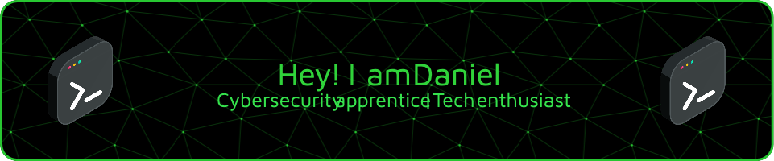

<h2> 🤓 WHOAMI</h2>

Technology professional with 14+ years of experience across IT Operations, Enterprise Networking, SIP Services and Infrastructure Support.
Currently working at Colt Technology Services delivering enterprise voice and networking solutions for global customers across EMEA, APAC and North America.
After completing a Master's Degree in Cybersecurity and Privacy, I am focusing my career on Security Operations, Cloud Security, Threat Detection and Vulnerability Management.

Current learning path:

- eJPT
- ICCA
- AZ-104
- Wazuh
- Azure Sentinel
- Detection Engineering

<h2> :computer: Cybersecurity Projects</h2>

- [File Integrity Monitoring](https://github.com/DanielDominguezBender/FileIntegrityMonitoring)
- [Keylogger](https://github.com/DanielDominguezBender/Keylogger)
- [Forensic Analysis](https://github.com/DanielDominguezBender/ForensicAnalysis) 
- [Pentesting - Metasploit](https://github.com/DanielDominguezBender/Pentesting-Metasploit-Vulnerabilities) 
- [SQL Injection](https://github.com/DanielDominguezBender/SQLi) 
- [IDS - Snort](https://github.com/DanielDominguezBender/Snort) 
- [Port Scanner (Programmed in Rust)](https://github.com/DanielDominguezBender/PortScanner-Rust) 
- [GPOs - Security Compliance](https://github.com/DanielDominguezBender/Cybersecurity_Compliance)

>[!NOTE]
> Will come in short :soon:
> [Blockchain]
> [Raspberry projects]
> [WSL]
> [Prepare Linux Terminal for developing]

<h2> :microscope: Labs</h2>

- [dockerlabs.es](https://github.com/DanielDominguezBender/dockerlabs.es) 
- [Pentesting - CTF](https://github.com/DanielDominguezBender/Pentesting-CTF/blob/main/README.md) 
- [Create VM and run Web Server on it](https://github.com/DanielDominguezBender/Azure-Create-a-VM-machine) 
- [Azure - Sentinel](https://github.com/DanielDominguezBender/Azure/blob/main/Sentinel)

<!-- Técnicas de ocultación de la información -->

<h2> :black_nib: :page_with_curl: Write-Ups</h2>

- [Over the wire](https://github.com/DanielDominguezBender/OverTheWire)
- [DockerLabs](https://github.com/DanielDominguezBender/dockerlabs.es)
- [TryHackMe](https://github.com/DanielDominguezBender/TryHackMe)

<h2> :books: Education</h2>
- Master Degree in Cybersecurity and Privacy - <a href="https://www.uoc.edu/es"> UOC </a>  
- Degree in Computer Engineering - <a href="https://www.uoc.edu/es"> UOC </a>  

<h2> :scroll: Certifications </h2>
- Curso básico técnico de Ciberseguridad por el Instituto Nacional de Ciberseguridad (INCIBE) 
- Google Cybersecurity Certificate 
- Freecodecamp Javascript Algorithms and Data Structures 
- Freecodecamp Responsive Web Design 

<h2> :sound: Podcasts I'm currently listening to:</h2>
- Darknet Diaries (Jack Ryshider) 
- The Audit - Cybersecurity Podcast 
- Huberman Lab (Andrew Huberman) 
- Cybersecurity Simplified (Susanna Song & David Barton)

<h2> :cloud: Tryhackme Progress</h2>

<!--
**DanielDominguezBender/DanielDominguezBender** is a ✨ _special_ ✨ repository because its `README.md` (this file) appears on your GitHub profile.

Here are some ideas to get you started:

- 🔭 I’m currently working on ...
- 🌱 I’m currently learning ...
- 👯 I’m looking to collaborate on ...
- 🤔 I’m looking for help with ...
- 💬 Ask me about ...
- 📫 How to reach me: ...
- 😄 Pronouns: ...
- ⚡ Fun fact: ...
-->
