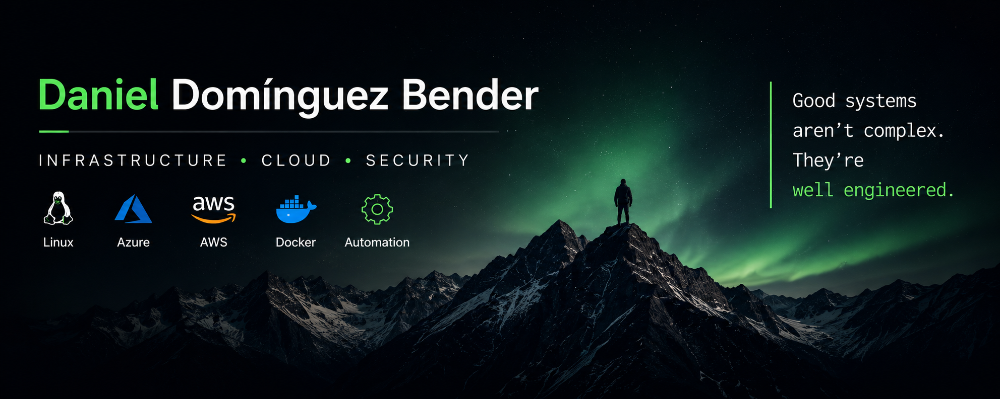

  
  
  
  
  
  

# Hello, I'm Daniel

Technology professional with **10+ years of experience** across IT Operations, Enterprise Networking, SIP Services, Infrastructure Support and Enterprise Voice Solutions.

Currently working at **Colt Technology Services**, supporting multinational customers across **EMEA, APAC and North America**.

After completing a **Master's Degree in Cybersecurity and Privacy**, I am focusing my career on:

* Security Operations
* Threat Detection
* Vulnerability Management
* Security Engineering
* Cloud Security
* Detection Engineering

My objective is to combine extensive enterprise infrastructure experience with modern cybersecurity practices to build secure and resilient environments.

---

# Enterprise Experience Snapshot

| Area              | Details                                    |
| ----------------- | ------------------------------------------ |
| Experience        | 10+ Years                                  |
| Current Role      | Lead Technical Analyst                     |
| Industry          | Telecommunications & Enterprise IT         |
| Networking        | Enterprise Networking, SIP, VoIP, MPLS     |
| Security Focus    | Security Operations & Security Engineering |
| Regions Supported | EMEA, APAC, North America                  |
| Languages         | English, German, Spanish, Catalan          |

---

# Current Roadmap

| Goal                  | Status         |
| --------------------- | -------------- |
| eJPT                  | 🟨 In Progress |
| Wazuh SIEM            | 🟩 Learning    |
| Microsoft Sentinel    | 🟩 Learning    |
| Detection Engineering | 🟨 Learning    |
| Threat Hunting        | 🟨 Learning    |

---

# Industry Contributions

Cybersecurity Subject Matter Expert (SME) featured in Beroe Inc.'s Premium Market Research Report:
  - IT Managed Security Services (2026)
  - Topics: AI in Cybersecurity, SOC Operations, Security Automation, Human-in-the-Loop Governance

---

# Featured Security Projects

| Project                       | Category                 | Technologies        |
| ----------------------------- | ------------------------ | ------------------- |
| File Integrity Monitoring     | Blue Team                | Python, Windows     |
| OpenVAS Assessment            | Vulnerability Management | OpenVAS             |
| Azure Sentinel Honeypot       | SIEM                     | Azure, Sentinel     |
| Active Directory Security Lab | Security Operations      | Windows Server, GPO |
| pfSense Segmentation Lab      | Network Security         | pfSense             |
| Port Scanner                  | Development              | Rust                |

---

# Cybersecurity Portfolio

| Repository                                                                                                | Description                          |
| --------------------------------------------------------------------------------------------------------- | ------------------------------------ |
| [File Integrity Monitoring](https://github.com/DanielDominguezBender/FileIntegrityMonitoring)             | Detect unauthorized file changes     |
| [Forensic Analysis](https://github.com/DanielDominguezBender/ForensicAnalysis)                            | Digital forensic investigations      |
| [Pentesting - Metasploit](https://github.com/DanielDominguezBender/Pentesting-Metasploit-Vulnerabilities) | Vulnerability exploitation exercises |
| [SQL Injection](https://github.com/DanielDominguezBender/SQLi)                                            | SQL Injection testing and examples   |
| [IDS - Snort](https://github.com/DanielDominguezBender/Snort)                                             | Intrusion Detection Systems          |
| [Port Scanner (Rust)](https://github.com/DanielDominguezBender/PortScanner-Rust)                          | Network scanner developed in Rust    |
| [Security Compliance (GPO)](https://github.com/DanielDominguezBender/Cybersecurity_Compliance)            | Windows hardening and compliance     |

---

# Labs & Hands-On Practice

| Lab                                                                                         | Focus Area                |
| ------------------------------------------------------------------------------------------- | ------------------------- |
| [dockerlabs.es](https://github.com/DanielDominguezBender/dockerlabs.es)                     | Offensive Security        |
| [Pentesting CTF](https://github.com/DanielDominguezBender/Pentesting-CTF)                   | Capture The Flag          |
| [Azure VM Deployment](https://github.com/DanielDominguezBender/Azure-Create-a-VM-machine)   | Cloud Infrastructure      |
| [Microsoft Sentinel Lab](https://github.com/DanielDominguezBender/Azure/tree/main/Sentinel) | Cloud Security Monitoring |
| [Project-Guardian](https://github.com/DanielDominguezBender/project-guardian)               | Infraestructure Platform on a Raspberry PI 5 |
| [Project-Argus](https://github.com/DanielDominguezBender?tab=repositories)| Proxmox-based infrastructure, automation and monitoring homelab |

---

# Technical Write-Ups

| Platform                                                             | Content                       |
| -------------------------------------------------------------------- | ----------------------------- |
| [OverTheWire](https://github.com/DanielDominguezBender/OverTheWire)  | Linux and Security Challenges |
| [DockerLabs](https://github.com/DanielDominguezBender/dockerlabs.es) | Security Walkthroughs         |
| [TryHackMe](https://github.com/DanielDominguezBender/TryHackMe)      | Learning Notes and Write-Ups  |

---

# Technical Skills Matrix

| Domain      | Technologies                                                   |
| ----------- | -------------------------------------------------------------- |
| Security    | Wazuh, OpenVAS, Nmap, Wireshark, Snort, Burp Suite, Metasploit |
| Networking  | SIP, VoIP, MPLS, TCP/IP, Routing, Troubleshooting              |
| Cloud       | Azure, Microsoft Sentinel, AWS Fundamentals                    |
| Systems     | Linux, Windows Server, pfSense                                 |
| Automation  | Python, Bash, PowerShell                                       |
| Development | Rust, JavaScript                                               |

---

# Education

| Degree                                     | Institution                     |
| ------------------------------------------ | ------------------------------- |
| Master Degree in Cybersecurity and Privacy | Universitat Oberta de Catalunya |
| Degree in Computer Engineering             | Universitat Oberta de Catalunya |

---

# Certifications

  
  
  
  

---

# GitHub Statistics

  

  

  

---

# Connect With Me

* LinkedIn: https://www.linkedin.com/in/danieldominguezbender
* Xing: https://www.xing.com/profile/Daniel_DominguezBender/

---

> Building practical cybersecurity skills through hands-on projects, continuous learning and real-world enterprise experience.
