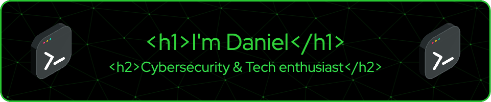

<h2> 🤓 WHOAMI</h2>

From a young age, I've been driven by curiosity about technology, starting with disassembling my Walkman 🎧. My interest in cybersecurity 🔒 led me to a Master's Degree 🎓, where I gained expertise in safeguarding digital landscapes 🌍. With over 10 years in IT 🖥️ and more than 2 years as a developer in business process automation 🤖, I'm passionate about technology's potential to empower and protect 🌟. Let's connect and explore tech together 🚀.

<h2> :computer: Cybersecurity Projects</h2>

- [File Integrity Monitoring](https://github.com/DanielDominguezBender/FileIntegrityMonitoring)
- [Keylogger](https://github.com/DanielDominguezBender/Keylogger)
- [Forensic Analysis](https://github.com/DanielDominguezBender/ForensicAnalysis) 
- [Pentesting - Metasploit](https://github.com/DanielDominguezBender/Pentesting-Metasploit-Vulnerabilities) 
- [SQL Injection](https://github.com/DanielDominguezBender/SQLi) 
- [IDS - Snort](https://github.com/DanielDominguezBender/Snort) 

>[!NOTE]
> Will come in short :soon:
> [SIEM]
> [Blockchain]
> [Raspberry projects]
> [WSL]
> [Prepare Linux Terminal for developing]

<h2> :microscope: Labs</h2>

- [dockerlabs.es](https://github.com/DanielDominguezBender/dockerlabs.es) 
- [Pentesting - CTF](https://github.com/DanielDominguezBender/Pentesting-CTF/blob/main/README.md) 
- [Create VM and run Web Server on it](https://github.com/DanielDominguezBender/Azure-Create-a-VM-machine) 

<!-- Técnicas de ocultación de la información -->

<h2> :books: Education</h2>
- Master Degree in Cybersecurity and Privacy - <a href="https://www.uoc.edu/es"> UOC </a>  
- Degree in Computer Engineering - <a href="https://www.uoc.edu/es"> UOC </a>  

<h2> :scroll: Certifications </h2>
- Google Cybersecurity Certificate 
- Freecodecamp Javascript Algorithms and Data Structures 
- Freecodecamp Responsive Web Design 

<h2> :sound: Podcasts I'm currently listening to:</h2>
- Darknet Diaries (Jack Ryshider) 
- Huberman Lab (Andrew Huberman) 
- Cybersecurity Simplified (Susanna Song & David Barton)

<h2> :cloud: Tryhackme Progress</h2>

<!--
**DanielDominguezBender/DanielDominguezBender** is a ✨ _special_ ✨ repository because its `README.md` (this file) appears on your GitHub profile.

Here are some ideas to get you started:

- 🔭 I’m currently working on ...
- 🌱 I’m currently learning ...
- 👯 I’m looking to collaborate on ...
- 🤔 I’m looking for help with ...
- 💬 Ask me about ...
- 📫 How to reach me: ...
- 😄 Pronouns: ...
- ⚡ Fun fact: ...
-->
